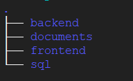

# IntelliRN

A project in collaboration with Faculty of Nursing, University of Calgary

## About

This is a project in collaboration with Nursing 654 students, Faculty of Nursing, University of Calgary. It aims to build a prototype that can help RNs manage an easy to use web portal, using which they can create surveys/questionnaires and educational articles for their clients or general public without any coding.

The prototype is deployed on the cloud and is accessible at [https://intellirn.ml](https://intellirn.ml/).

## Source code structure



- [`backend`](backend) - contains Spring Boot backend source code
- [`documents`](documents) - various documentation on the project
- [`frontend`](frontend) - contains React frontend source code
- [`sql`](sql) - contains MySQL database setup script

## Dependencies

- JDK version 11.0.11 or above
- Maven version 3.6.3 or above
- MySQL server version 8.0.26 or above
- Node version 8.1 or above

## Running it locally

Follow the steps to run the application on your local machine

1. Clone the repository to your local machine.

2. Start the MySQL server on your local machine. If you are accessing the MySQL server over a network, edit the property `spring.datasource.url` in the file [application.properties](backend/src/main/resources/application.properties) and replace `localhost` with the server IP address.

3. Connect to your MySQL server using an admin user like `root`.

4. Run the script [db_setup.sql](sql/db_setup.sql) on your MySQL server using `root`. This script will create a schema `intellirndb`, a user `intellirnapp` with password `intellirnpassword`, create all necessary tables and load them with some dummy data.

5. **To run the backend**

   1. On your machine, navigate to the directory [backend](backend). Running the below command will get the backend server running.

      ```bash
      $ mvn clean spring-boot:run
      ```

   2. To test all the implemented API endpoints, launch Postman on your local machine.

   3. Import [this](documents/IntelliRN.postman_collection.json) file into the Postman. You can then run all the API endpoints in the imported folder **IntelliRN** one by one.

   4. At any given time, you can also verify the database tables using the credentials mentioned in step #4.

6. **To run the frontend**

   1. On your machine, navigate to the directory [frontend](frontend). Running the below command will get the react server running and launch your default browser.
      ```bash
      $ npm install
      $ npm start
      ```

## Contributors

- [Bhavyai Gupta](https://github.com/zbhavyai)
- [Erika Wang](https://github.com/erikawyt)
- [Marko Mijovic](https://github.com/markomijovic)
- [Michael Ah Kiow](https://github.com/micdean19)
- [Michael Man Yin Lee](https://github.com/mikeePy)

## Attribution

1. Bootstrap eNno theme used to style the interface, downloaded from [here](https://bootstrapmade.com/).
2. Nurse logo used as favicon, created by Icon Pond, downloaded from [here](https://www.flaticon.com/free-icons/nurse).
